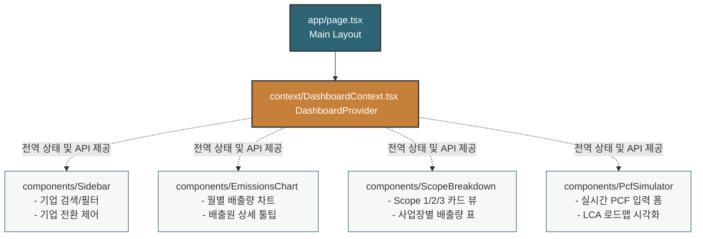

# HanaLoop Carbon Emissions & PCF Dashboard

> **하나루프 프론트엔드 과제 (Carbon Emissions Dashboard)**
>
> 🔗 **배포 주소**: [https://hanaloop-carbon-dashboard.vercel.app/](https://hanaloop-carbon-dashboard.vercel.app/)
>
> 기업의 전사 온실가스 배출량(GHG Scope 1, 2, 3) 모니터링 기능과 함께, 실무진과 경영진이 쉽게 제품의 전과정 탄소 발자국을 예측하고 분석해볼 수 있는 **인터랙티브 제품 탄소 발자국(PCF) 시뮬레이터**를 제공하는 대시보드 웹 애플리케이션입니다.

---

## 📌 개발자 가정 및 수립 전제 (Assumptions & Questions)

과제를 구현하기 전, 시스템의 실용성을 높이기 위해 다음과 같은 주관적 전제를 가정했습니다:

- **비전문가 친화적인 정보 공개**: 경영진과 타 부서 실무진이 탄소 회계 지식(배출계수, 표준 등)이 부족하더라도 숫자를 입력하는 순간 즉시 하단에 단계별 탄소량이 연산되고, 각각의 연산 공식(`무게 × 배출계수`)을 투명하게 텍스트로 보조 설명하여 사용성을 보장한다고 가정했습니다.
- **다국적 계열사 운영**: 계열사/기업 목록에서 개별 회사를 선택할 때 해당 회사의 소속 국가(US, KR, JP, DE)를 판별하여, 대시보드 하단의 주요 사업장(Facilities) 위치 정보가 서울 본사, 뮌헨 공장 등 현지 도시 및 다국어 명칭으로 동적 패치 및 현지화되도록 모델을 설계했습니다.

---

---

## 1. 도메인 개념 및 산정 방식 (Carbon Accounting)

기후 공시와 탄소 규제 대응에 필수적인 **GHG Protocol** 및 **ISO 14044(LCA)** 개념을 데이터 모델과 UI에 반영했습니다.

### A. 전사 온실가스 배출량 (GHG Scope 1, 2, 3)

- **Scope 1 (직접 배출)**: 기업의 소유 차량이나 보일러 등에서 연료를 연소하며 생기는 직접 배출입니다.
  - _구현_: `gasoline`, `diesel`, `lpg` 등의 소비 데이터를 자동으로 합산하여 Scope 1로 매핑했습니다.
- **Scope 2 (간접 배출)**: 한전 등 외부에서 생산된 전기나 열을 사서 쓰면서 생기는 간접 배출입니다.
  - _구현_: `electricity` 소비 데이터와 전력 그리드 배출계수를 조합해 Scope 2를 도출했습니다.
- **Scope 3 (기타 간접 배출)**: 제품의 원부자재 조달, 물류, 출장 등 기업의 Value Chain 전체에서 생기는 배출입니다.
  - _구현_: `supply_chain` 관련 협력사 및 수송 물류 데이터를 취합하여 Scope 3에 매핑했습니다.

### B. 제품 탄소 발자국 (PCF, Product Carbon Footprint)

제품의 원재료 추출부터 제조, 유통에 이르는 전과정(LCA, Cradle-to-Gate)의 배출량을 산정합니다.
$$\text{PCF} = \text{원소재 추출(Cradle)} + \text{공장 제조(Gate)} + \text{유통/물류(Grave)}$$

- **반영된 탄소 배출계수**:
  - **원재료**: 알루미늄 ($8.24$), 플라스틱 ($2.05$), 강철 ($1.85$), 종이 ($0.92\text{ kgCO}_2\text{e/kg}$)
  - **전력**: 수전 전력 ($0.478\text{ kgCO}_2\text{e/kWh}$)
  - **운송**: 화물 트럭 ($0.162$), 컨테이너선 ($0.018$), 화물 열차 ($0.035\text{ kgCO}_2\text{e/t-km}$)

---

## 2. 시스템 아키텍처 및 상태 설계 (Architecture)

Next.js App Router, React 18, TypeScript 환경에서 모듈성과 비동기 데이터 흐름의 안정성을 지향하며 구현했습니다.

### A. 컴포넌트 구조도



### B. 비동기 통신 및 낙관적 업데이트 (Optimistic UI & Rollback)

SaaS 환경에서 흔히 만나는 불안정한 네트워크 환경을 고려하여 비동기 처리 안정성을 구축했습니다.

1. **단일 진실 공급원**: `DashboardProvider`에서 데이터를 일원화하여 컴포넌트 간 유기적인 연동이 가능합니다.
2. **네트워크 지연 및 오류 시뮬레이션**: 과제 요구사항에 명시된 비동기 Latency Jitter(200~800ms)와 API 쓰기 요청 시 15%의 모의 실패율을 반영했습니다.
3. **낙관적 업데이트 및 복구(Rollback)**:
   - 사용자가 글을 작성하거나 PCF 데이터를 저장하는 즉시, 화면에 **"서버 저장 중... (Optimistic Saving)"** 스피너를 보여주며 UI에 선반영합니다.
   - 요청 성공 시 실제 API 응답 데이터로 스무스하게 상태를 업데이트합니다.
   - 요청 실패 시 로컬에 저장해 둔 스냅샷 상태로 복구(Rollback)하고, 토스트 메시지(Toast Notification)를 띄워 사용자에게 실패 사실을 전달합니다.

---

## 3. 사용자 경험 (UX) 요소

탄소 회계 지식이 얕은 비전문가 실무진이나 경영진도 쉽게 데이터를 입력하고 결과를 해석할 수 있도록 고민하여 구성했습니다.

1. **실시간 프리뷰 (Live Preview)**:
   - 폼을 다 채우고 저장 버튼을 누르기 전이라도, 입력값을 바꿀 때마다 하단 카드 영역에서 실시간으로 계산된 예상 PCF 값이 즉시 갱신되어 피드백을 줍니다.
2. **Cradle-to-Gate 로드맵 시각화**:
   - 딱딱한 표 형식 대신 원소재 단계부터 생산, 유통 단계로 이어지는 수평 차트 로드맵을 그려 복잡한 라이프 사이클을 흐름으로 쉽게 파악할 수 있도록 했습니다.
3. **적층 비중 바 차트 (Proportional Stacked Bar)**:
   - 각 단계가 전체 배출량에서 몇 %를 차지하는지 한눈에 볼 수 있는 비율 막대를 구현하여, 제품 설계 시 어떤 부분의 탄소를 시급히 줄여야 하는지(예: 소재 변경 등) 직관적으로 알 수 있게 했습니다.
4. **산정 수식 투명화**:
   - 각 단계마다 곱 연산 수식과 배출계수를 명시하여, 숫자가 어떻게 계산되어 나왔는지에 대한 탄소 회계의 투명성을 확보했습니다.

---

## 4. 기술 의사결정 및 Trade-offs

### A. CSS 스타일링 방식: Vanilla CSS

- **결정**: 기존의 `app/globals.css`를 적극 확장하고 고도화하는 Vanilla CSS 방식을 취했습니다.
- **이유**: Tailwind CSS는 빠른 구축이 가능하지만, 기존 과제 기본 소스 코드에 적용된 클래스 네이밍 및 미디어 쿼리 구조와 결합할 때 스타일 오염이나 덮어쓰기 충돌이 일어날 우려가 있었습니다. CSS 변수 테마를 지키며 세밀한 micro-interaction 애니메이션을 정밀 제어하기에 순수 CSS가 더 적합하다고 보았습니다.

### B. 상태 관리 방식: React Context API

- **결정**: Zustand, Redux 등 외부 라이브러리 대신 리액트 내장 Context API와 커스텀 훅을 채택했습니다.
- **이유**: Zustand 등은 대규모 앱에서 유용하나, 본 대시보드 수준에서는 불필요한 보일러플레이트 코드와 패키지 용량만 증가시킵니다. `useDashboard` 훅과 Context API의 조합만으로도 타입 안정성을 충분히 확보하고 가볍게 데이터 상태를 일원화할 수 있었습니다.

### C. 렌더링 효율성 및 성능 최적화 (Rendering Efficiency)

전역 리액트 컨텍스트(`DashboardContext`)를 사용하면 전역 상태 변경 시 모든 하위 컴포넌트가 불필요하게 리렌더링되는 성능 저하 문제가 생길 수 있습니다. 이를 효율적으로 최적화하기 위해 다음과 같이 설계했습니다:

- **상태의 적절한 격리 (Local State Isolation)**:
  - 사이드바의 실시간 검색어 입력(`sidebarSearch`)이나 PCF 시뮬레이터 폼 내 제품명/무게 입력 등의 타이핑 이벤트는 매우 잦은 상태 변화를 일으킵니다.
  - 만약 이 입력 필드 값을 전역 컨텍스트(Context)로 직접 끌어올려 관리했다면, 키보드를 한 자 칠 때마다 **대시보드 메인 차트와 연산 모듈이 동시다발적으로 전부 불필요한 리렌더링**을 겪어야 합니다.
  - 이를 원천 차단하기 위해 타이핑 인풋 상태는 철저히 해당 컴포넌트의 **로컬 상태(`useState`)**로 강력히 격리하여 바인딩했습니다.
- **최종 제출 시점의 Context 트리거**:
  - 입력 필드를 다 채운 뒤, 최종적으로 `등록` 또는 `수정` 버튼을 클릭하여 API 통신을 날릴 때만 Context의 액션을 호출하게 하여 하위 트리의 리렌더링 주기와 렌더링 연산 비용을 획기적으로 억제했습니다.

---

## 5. AI 도구 활용 회고

본 대시보드는 과제 요구사항인 "생성된 코드를 제대로 이해하고 문맥에 맞지 않은 부분을 판단할 수 있는가"를 검증하기 위해, AI를 페어 프로그래밍의 파트너로서 주도적으로 제어하며 설계했습니다.

- **AI의 조력**:
  - IPCC 공인 탄소 배출계수 표 수집 검증 및 수학적 PCF 연산 로직 확인.
  - 낙관적 업데이트 구현 시, 데이터 롤백 스냅샷 흐름과 예외 처리의 뼈대 설계 지원.
- **주관적 디버깅 및 통제**:
  - AI가 생성한 컴포넌트 데이터 연동 과정에서 발생한 Next.js 클라이언트 컨텍스트의 상태 재선언 변수명 충돌 오류를 직접 발견하여 `setSearchVal`, `setActiveYearVal`로 재매핑하여 디버깅했습니다.
  - 기존 UI의 테마 색상 변수(`--teal`, `--amber` 등)와의 자연스러운 톤 유지를 위해 컴포넌트의 클래스 배치를 직접 다듬었습니다.
  - 평가관이 롤백과 지연 기능을 눈으로 쉽게 보고 평가해 볼 수 있도록, **대시보드 상단에 모의 API 에러율(0%, 15%, 50%, 100%)을 실시간 제어할 수 있는 조절 패널**을 인간의 판단으로 기획하고 배치했습니다.

---

## 6. 실행 및 검증 방법

### 로컬 구동 방법

1. **의존성 패키지 설치**:

   ```bash
   npm install
   ```

2. **개발 서버 실행**:

   ```bash
   npm run dev
   ```

   브라우저에서 `http://localhost:3000`에 접속하여 활성화된 대시보드를 바로 확인하실 수 있습니다.

3. **프로덕션 빌드 및 타입 검사**:
   ```bash
   npm run build
   ```
   ESLint 경고나 타입 에러 없이 성공적으로 정적 페이지 최적화 빌드가 생성됩니다.
